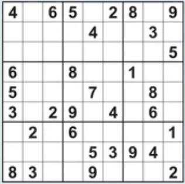
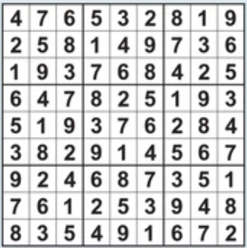

# SudokuSolver

Enter an unsolved 9x9 sudoku puzzle and determine whether it can be solved or not. If it can be solved, the solution will be printed. 

Here is an example of what is printed for a puzzle that has a solution: 

After entering the input for the unsolved puzzle: 

```
[[4, -1, 6, 5, -1, 2, 8, -1, 9],
 [-1, -1, -1, -1, 4, -1, -1, 3, -1],
 [-1, -1, -1, -1, -1, -1, -1, -1, 5],
 [6, -1, -1, 8, -1, -1, 1, -1, -1],
 [5, -1, -1, -1, 7, -1, -1, 8, -1],
 [3, -1, 2, 9, -1, 4, -1, 6, -1],
 [-1, 2, -1, 6, -1, -1, -1, -1, 1],
 [-1, -1, -1, -1, 5, 3, 9, 4, -1],
 [8, 3, -1, -1, 9, -1, -1, -1, 2]]

```
This list of lists of the unsolved puzzle represents a sudoku board that looks like this: 



If the puzzle can be solved, it will return true and print the solution to the puzzle:
```
True
[[4, 7, 6, 5, 3, 2, 8, 1, 9],
 [2, 5, 8, 1, 4, 9, 7, 3, 6],
 [1, 9, 3, 7, 6, 8, 4, 2, 5],
 [6, 4, 7, 8, 2, 5, 1, 9, 3],
 [5, 1, 9, 3, 7, 6, 2, 8, 4],
 [3, 8, 2, 9, 1, 4, 5, 6, 7],
 [9, 2, 4, 6, 8, 7, 3, 5, 1],
 [7, 6, 1, 2, 5, 3, 9, 4, 8],
 [8, 3, 5, 4, 9, 1, 6, 7, 2]]

 ```

 This list of lists of the solved puzzle represents a solved sudoku board that looks like this:
 

 Source for this project: https://www.youtube.com/watch?v=8ext9G7xspg&t=6715s&ab_channel=freeCodeCamp.org 